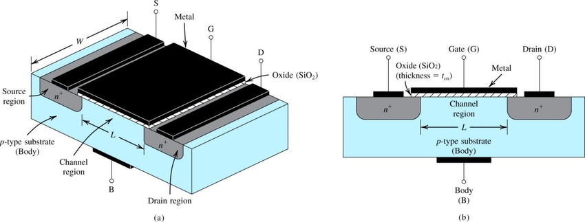

### Section 1: Intro: Cheating our way past the transistor -- 0.5 weeks
- So about those transistors -- Course overview. Describe how FPGAs are buildable using transistors, and that ICs are just collections of transistors in a nice reliable package. Understand the LUTs and stuff. Talk briefly about the theory of transistors, but all projects must build on each other so we can’t build one.
- Emulation -- Building on real hardware limits the reach of this course. Using something like Verilator will allow anyone with a computer to play.

#### What is a transistor (classic Bipolar Junction transistor)?
- electronic device with three terminals
- the conduction between the two terminals (electrodes) depends on the availability of charge carriers, which is controlled by a voltage applied to a third control electrode. 
- the terminal that receives the small current/voltage is called the base/gate. The other two terminals are called the emitter/drain and collector/source.
- the exact namings of these terminals depend on the type of transistor (Either Bipolar Junction transistor or MosFET (metal oxide field effect transistor)).
- can function as switches or amplifiers (since the gain V_out / V_in > 1)
- all chips are made from FETs.

##### FETs
- field effect transistor.
- four terminal: gate, source, drain and bulk.
- silicon is taken and doped either with electrons (so it's negatively charged) or holes (electrons taken away, so positively charged)
    - doped == infused with atoms of another substance when forming the main crystal

- n-channel mosfet: electron carriers (conduction by electrons) (drain --> source, current is present from drain to source when the gate voltage is high)
- p-channel mosfet: hole carriers (conduction by lack of electrons) (source --> drain, current is present from source to drain when the gate voltage is low)
- it may seem that current can only flow in one direction depending on whether you have an n-type of p-type FET, but that's not true
    - once you drive the gate, the channel is closed (low resistance) so electrons will flow from one terminal to another
    - still, it's nice to annotate direction...
- simple model of how it works: drive voltage on the gate, in turn the electric field generated inverses the channel making it conductive between the drain and source.
    - gate is isolted from the channel through a very thin isolating layer
- the width of the channel between the drain and the source is the actual fab size (14nm, 7nm etc.)

- normal operation for an N-type FET: drain is more positive than the source. No current flows from drain to source unless the base is brought to be positive relative to the source

FETs have 3 states:
1. cutoff (no drain/source current).
2. active (source within a few tenths of a volt above the drain).
3. saturation (source within a few tenths of a volt of the drain).

##### Cool, but how do you make transistors?
- you first need to make a silicon ingot. You can make that through the Chernavsky process where the ingot is grown from a seed of silicon dipped in silicae.
- what comes out is a nice cylindrical shaped pure silicon ingot. While manufacturing this ingot you can also dope it
    - negative charges are obtained by doping with phosphorus, positive by doping with boron.
- you take the ingot and slice it laterally to get silicon wafer
- through photolitography and many other manufacturing steps you kind of print the actual circuit on this wafer.
    - manufacturing an IC == deposit new material on the wafer + etch existing layers.
    - use photolitography == light focused through masks
- you make a bunch of chips on the wafer. Chips are then sawed off from the wafer after fab
- [guy making a FET in his house](https://www.youtube.com/watch?v=s1MCi7FliVY)

##### What's an integrated circuit (IC)?
- quite literally an array of transistors packed into a single semiconductor material.
- each IC can accomplish some specific task and even though there are many ICs out there, sometimes it's still better to do your own circuit from discrete transistors.

gate-arrays --> prefab arrays of transistor gates on the wafer (mass-produced). Then for each design, only customize metal layer.

#### FPGAs
- it's an IC
- array of cells
- can be programmed with new logic designs, same as ICs can be programmed with new firmware
- each cell of the array contains a programmable logic function (CLB i.e. control logic block)
    - [Xilinx's CLB](https://ocw.mit.edu/courses/electrical-engineering-and-computer-science/6-884-complex-digital-systems-spring-2005/lecture-notes/l01_intro.pdf)
- the boolean function is saved in a look-up table within the CLB
    - lookup table i.e. LUT
    - LUT acts like memory. 4-in 1-out LUT can generate any 4-input boolean logic function
- array has programmable interconnect between logic functions (so interconnects between `CLB`s and `IO` blocks)
- arrays mass-produced, then programmed after fab
    - programmed by blowing fuses, loading SRAM bits or flashing (probably from bootrom, not sure)
- cannot set initial state, since all is based on voltages; so you always need to wait for signals to settle, which you need to account for in the design.
- `coarse grained` elements: dedicated memory (block RAM), embedded processors, flash memory, floating point units, multipliers etc. basically anything that's already pre-fabed
    - main benefit: reduce density compared to building them from `CLB`s only.

As in Verilog, three abstraction layer of programming FPGAs (generalized, in reality can be more):
- unit-transaction level (behavioural)
- register transfer level
- gate level
One iterates between all of them to meet functionality, fab and timing constraints

##### CLB
- this is considered `fine-grained` fabric
- made out of an (read-only) LUT, a D-Flip-Flop and a multiplexer (this is called a slice, there can be multiple slices in the CLB) + a fast interconnect.
    - in reality this can be a bit more complex as a CLB can actually be made of multiples "slices", each of which contains an LUT, a DFF and some multiplexers + interconnects
    - slices can also have other sutff like carry chains, shift registers, internal muxes, xor gates etc.
- interconnects can be routed to other CLBs, IO blocks or some other coarse grained on-board fabric
- LUT stores the functions outputs
- the multiplexer is used to select an output based on the input (all from LUT)
- in order to update the LUT based on the result of some combinational logic, use the DFF. DFF is needed to make the whole thing sequential
- basically: LUT (has outputs) -> Multiplexer (inputs is LUT, single output, selectors are the inputs) -> DFF (to make the whole thing sequentially valid and have the reads driven by the CLK)
    - the DFF here is optional and only needed if you need to make a sequential circuit.
    - if a combinational is needed, then DFF is skipped
    - a MUX is used to select between DFF and single LUT-MUX output
- LUT + MUX == latch (asynchronous result)
- LUT + MUX + DFF == flip-flop (synchronous CLK edge triggered result)

#### Other stuff
- high-impedance == allow relatively small current through per unit of applied voltage
    - three state path == allow the output to be 0, 1 or simply have high impedance
    - this allows multiple circuits to share the same wires/lines/buses, by rendering on of the outputs/inputs of a circuit obsolete at a certain point in time (obsolete == high impedance)
    - outputs are tri-stated => their influence on the circuit is removed

#### Resources
- [MOSFETs](https://www.youtube.com/watch?v=ymFfw_MGceI)
- [Zooming into wafer](https://www.youtube.com/watch?v=Fxv3JoS1uY8)
- [computation structures MIT](https://computationstructures.org/index.html)
    - go through the first section "Digital Circuits"
- [CMOS fabrication](https://ocw.mit.edu/courses/electrical-engineering-and-computer-science/6-884-complex-digital-systems-spring-2005/lecture-notes/l03_cmos_gates.pdf)
- [CLBs](https://www.youtube.com/watch?v=9tcy40wPfCI)
- [LUT applications on Xilinx FPGAs - Shift Registers](https://www.xilinx.com/support/documentation/application_notes/xapp465.pdf)
- [LUT applications on Xilinx FPGAs - Distributed RAM](https://www.xilinx.com/support/documentation/application_notes/xapp464.pdf)
- [Xilinx FPGA data sheet with CLBs explained](https://www.xilinx.com/support/documentation/data_sheets/ds099.pdf)
    - this is actually quite nice since it also explains IO blocks, interconnects, how the clock works in an FPGA (and how can you change its its frequency i.e. phase shifting)
- [DDR muxes](http://spadic.uni-hd.de/publications/talks/2016/2016-09-28_ddrmux.pdf)
- [Shift registers](https://en.wikipedia.org/wiki/Shift_register)
    - so you can serialize data nicely
- [Hobbyist guide to FPGAs](https://hackaday.io/project/27550-the-hobbyists-guide-to-fpgas)
- [Modeling interconnects between coarse and fine-grained FPGA fabrics](http://downloads.hindawi.com/journals/ijrc/2008/736203.pdf)
